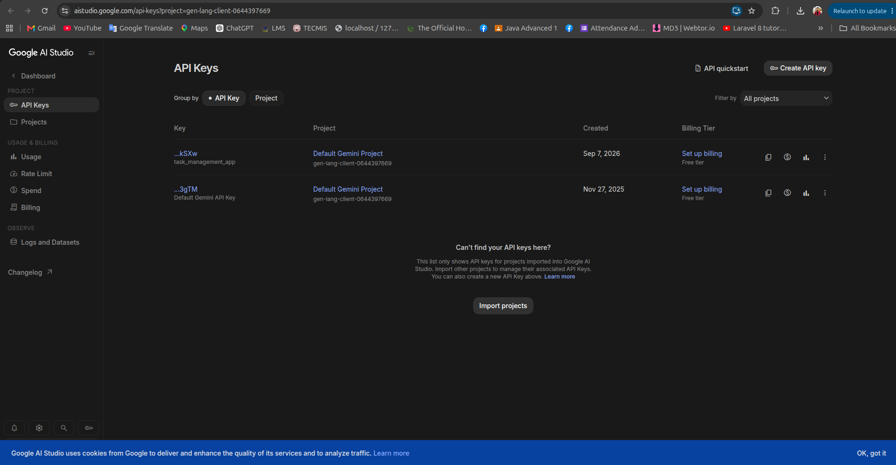
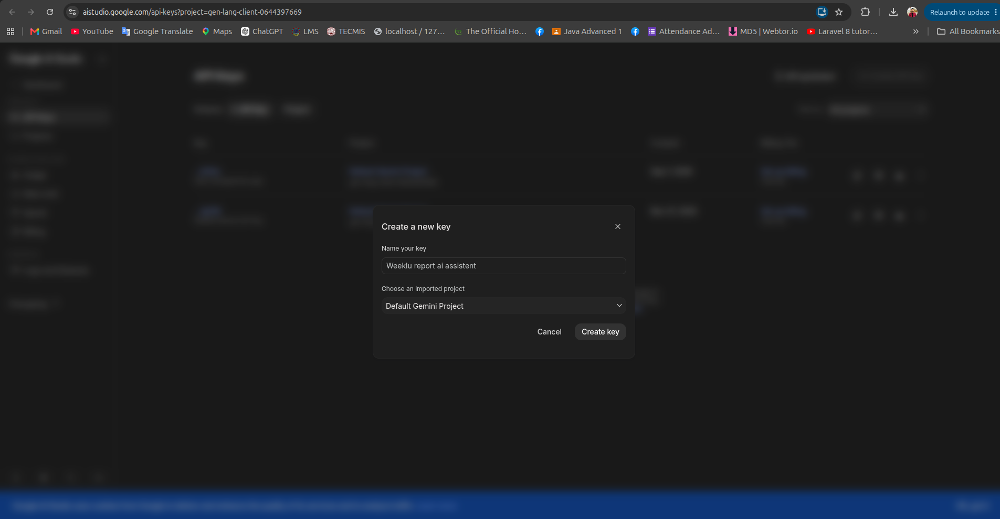

# Weekly Report Generator — FastAPI Backend

A production-ready **FastAPI + Python** backend for the Weekly Report Generator and Team Dashboard.

The backend provides authentication, role-based access, project management, weekly report workflows, report version history, dashboards, analytics, and a Gemini-powered AI assistant.

---

## Tech Stack

- **Python 3.12**
- **FastAPI**
- **SQLAlchemy Async**
- **asyncmy**
- **MySQL 8**
- **Alembic**
- **Pydantic**
- **JWT Authentication**
- **Argon2 Password Hashing**
- **Gemini AI**
- **pytest**

---

# Local Development Setup

Follow the steps below in order to run the backend locally.

## 1. Prerequisites

Make sure the following are installed:

- Python 3.12+
- MySQL 8
- Git

Verify Python:

```bash
python3.12 --version
```

Verify MySQL:

```bash
mysql --version
```

---

## 2. Clone the Repository

Clone the project and move into the backend directory:

```bash
git clone <repository-url>
cd <project-directory>
```

---

## 3. Create a Virtual Environment

Create a Python virtual environment:

```bash
python3.12 -m venv .venv
```

Activate the virtual environment.

### Linux / macOS

```bash
source .venv/bin/activate
```

### Windows

```bash
.venv\Scripts\activate
```

---

## 4. Install Dependencies

Install all backend dependencies from `requirements.txt`:

```bash
pip install -r requirements.txt
```

---

## 5. Create the Environment File

Create your local `.env` file from the example configuration:

```bash
cp .env.example .env
```

Open `.env` and update the configuration according to your local environment.

```env
DATABASE_URL=mysql+asyncmy://root@127.0.0.1:3306/weekly_report

JWT_SECRET_KEY=CHANGE_THIS_TO_A_SECURE_SECRET

JWT_ALGORITHM=HS256

ACCESS_TOKEN_EXPIRE_MINUTES=60

CORS_ORIGINS=http://127.0.0.1:3000

GEMINI_API_KEY=YOUR_GEMINI_API_KEY

GEMINI_MODEL=gemini-3.7-flash

AI_CONTEXT_WEEKS=12
```

### Environment Variables

| Variable | Description |
|---|---|
| `DATABASE_URL` | MySQL database connection URL |
| `JWT_SECRET_KEY` | Secret used to sign JWT tokens |
| `JWT_ALGORITHM` | JWT signing algorithm |
| `ACCESS_TOKEN_EXPIRE_MINUTES` | Access token expiration time |
| `CORS_ORIGINS` | Allowed frontend origin |
| `GEMINI_API_KEY` | Google Gemini API key |
| `GEMINI_MODEL` | Gemini model used by the AI assistant |
| `AI_CONTEXT_WEEKS` | Number of previous weeks used as AI context |

> **Important:** Never commit `.env`, database passwords, JWT secrets, or Gemini API keys to Git.

---

# Gemini API Key Setup

The AI assistant requires a Gemini API key.

## 6. Open Google AI Studio

Open the Google AI Studio API Keys page:

[Google AI Studio — API Keys](https://aistudio.google.com/app/api-keys?project=gen-lang-client-0644397669)

Sign in using the Google account that you want to use for the Gemini API.

---

## 7. Open the API Keys Page

After opening Google AI Studio, go to **API Keys**.

The page should look similar to this:



---

## 8. Create a New API Key

Click **Create API key**.

In the **Create a new key** dialog:

1. Enter a descriptive name for the API key.
   - Example: `Weekly Report AI Assistant`
2. Select the required Google AI Studio project.
3. Click **Create key**.



---

## 9. Copy the API Key

After the key is created, copy the generated API key.

Keep the key private.

> **Never** share your Gemini API key publicly or commit it to Git.

---

## 10. Add the Gemini API Key to `.env`

Open the backend `.env` file and replace:

```env
GEMINI_API_KEY=YOUR_GEMINI_API_KEY
```

with your actual API key:

```env
GEMINI_API_KEY=your_actual_gemini_api_key
```

The Gemini API key must remain on the **FastAPI backend**.

Do not add it to frontend environment variables such as `NEXT_PUBLIC_*`.

---

# Database Setup

## 11. Start MySQL

Start the MySQL service:

```bash
sudo systemctl start mysql
```

Check that MySQL is running:

```bash
sudo systemctl status mysql
```

---

## 12. Log in to MySQL

Open the MySQL client:

```bash
mysql -u root -p
```

Enter your MySQL password when prompted.

---

## 13. Create the Database

Create the `weekly_report` database:

```sql
CREATE DATABASE weekly_report
CHARACTER SET utf8mb4
COLLATE utf8mb4_unicode_ci;
```

Exit MySQL:

```sql
EXIT;
```

---

# Database Migration

## 14. Run Alembic Migrations

Apply the database migrations:

```bash
alembic upgrade head
```

This creates and updates the required database tables.

---

# Demo Data

## 15. Seed Demo Data

After the migrations complete successfully, seed the demo users and project:

```bash
uv run python -m app.db.seeders.demo_data
```

This prepares the database with the sample data required for local development and testing.

---

# Run the Backend

## 16. Start the FastAPI Server

Start the development server:

```bash
uvicorn app.main --reload
```

The backend will be available at:

**http://127.0.0.1:8000**

---

## API Documentation

FastAPI automatically provides interactive API documentation.

Open:

**http://127.0.0.1:8000/docs**

You can use Swagger UI to view and test the available API endpoints.

---

# Development Commands

The following commands are commonly used during development.

### Run database migrations

```bash
alembic upgrade head
```

### Seed demo data

```bash
uv run python -m app.db.seeders.demo_data
```

### Start development server

```bash
uvicorn app.main --reload
```

### Run tests

```bash
pytest -q
```

---

# Architecture

The backend follows a layered architecture:

```text
Router
   ↓
Service
   ↓
Repository
   ↓
SQLAlchemy
   ↓
MySQL
```

The router handles HTTP requests and authentication.

The service layer contains business rules and workflow logic.

The repository layer handles database queries and persistence.

---

# Main Features

- JWT authentication
- Team Member, Manager, and Admin roles
- User management
- Project management and member assignment
- Weekly report creation and submission
- Report review and correction workflow
- Report version history
- Draft privacy
- Dashboard and analytics
- Gemini AI assistant

---

# Report Workflow

Reports follow the workflow below:

```text
DRAFT
  ↓
SUBMITTED
  ↓
MANAGER REVIEW
  ├── APPROVED
  │
  └── NEEDS_CORRECTION
          ↓
     EDIT NEW VERSION
          ↓
       SUBMITTED
          ↓
       APPROVED
```

Old submitted versions remain unchanged.

Manager reviews are linked to the exact report version being reviewed.

---

# Role Access

| Feature | Team Member | Manager | Admin |
|---|:---:|:---:|:---:|
| Create/edit own reports | Yes | No | No |
| Submit own reports | Yes | No | No |
| View team reports | No | Yes | Yes |
| Request corrections | No | Yes | Yes |
| Approve reports | No | Yes | Yes |
| Dashboard and analytics | No | Yes | Yes |
| Manage projects | No | Yes | Yes |
| Manage users | No | No | Yes |
| AI assistant | No | Yes | Yes |

The backend remains the **final authorization boundary**.

Role and active-status checks are applied to protected requests.

---

# AI Assistant

The backend exposes the following endpoint:

```text
POST /api/v1/ai/chat
```

The AI assistant works as follows:

```text
User Request
     ↓
FastAPI
     ↓
Load Relevant Submitted Reports
     ↓
Create Structured Context
     ↓
Send Context to Gemini
     ↓
Return AI Response
```

The backend first loads relevant submitted report data, creates structured context, and then sends that context to Gemini.

The Gemini API key remains **only in the FastAPI backend**.

---

# Verification

After completing the installation, environment configuration, and database setup, run the test suite:

```bash
pytest -q
```

If the tests pass, start the backend:

```bash
uvicorn app.main --reload
```

Then open:

**http://127.0.0.1:8000**

For API documentation:

**http://127.0.0.1:8000/docs**

---

# Security Notes

Never commit or expose the following:

- `.env`
- Database passwords
- JWT signing secrets
- Gemini API keys
- Other private credentials

Make sure `.env` is included in `.gitignore`.

The Gemini API key should only be available to the FastAPI backend and should never be exposed through frontend code or `NEXT_PUBLIC_*` environment variables.